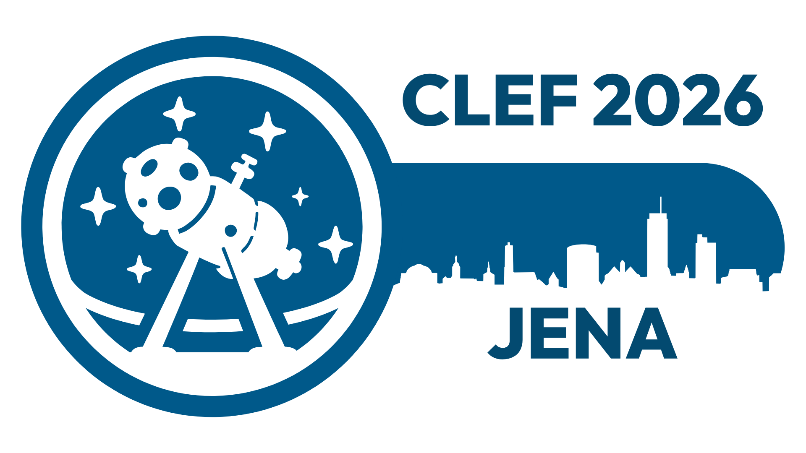

# CLEF 2026 SimpleText Track

---

  

## Simplify Scientific Text (and Nothing More)

Objective scientific information helps any user navigate a world where misinformation, disinformation, or unfounded generated information is only a single mouse click away. Everyone acknowledges the importance of objective scientific information, but the general public seldom consults scientific sources. For example, biomedical research can directly impact people's decisions about health. However, the most reliable and up-to-date sources in biomedicine contain complex language and assume a high degree of background knowledge, making them difficult for the general public to understand.

While significant progress has been made in enhancing accessibility through LLMs, challenges like balancing simplicity with accuracy, dense technical terminology, maintaining logical flow, and adapting to varied audiences remain challenging. Moreover, LLMs can unintentionally introduce misinformation, distort meanings, or create content that deviates from the original text.

The main goal of the CLEF 2026 SimpleText track is to advance the field of natural language processing by addressing key challenges in simplifying complex scientific texts, ensuring the reliability and accuracy of generated content, and refining popular tasks from previous editions. To ensure the transition to the new track setup, we will revisit and rerun some of the earlier tasks by popular demand.
 
## [Tasks](./tasks)

- [Task 1](./tasks): Text Simplification: Simplify scientific text
  - Task 1.1 - Sentence-level Scientific Text Simplification
  - Task 1.2 - Document-level Scientific Text Simplification 
- [Task 2](./tasks): Controlled Creativity: Identify and Avoid Hallucination
  - Task 2.1 - Identify Creative Generation at Document Level
  - Task 2.2 - Detect and Classify Information Distortion Errors in Simplified Sentences
  - Task 2.3 - Avoid Creative Generation and Perform Grounded Generation by Design
- [Task 3](./tasks): SimpleText 2024 Revisited: Selected tasks by popular request
  - Search: content selection
  - Complex terminology analysis
  - Complexities in evaluating generated definitions/explanations

## How to participate

In order to participate, you should sign up at the [CLEF](https://clef2025.clef-initiative.eu/index.php?page=Pages/registration.html) website. The registration closes on April 25, 2026.

All team members should join the SimpleText mailing list:
[https://groups.google.com/g/simpletext](https://groups.google.com/g/simpletext). 

The data will be made available to all registered participants.

## Acknowledgement  

SimpleText is supported by the French research network on Big Data - Data Science [MADICS](https://www.madics.fr/). This research was funded, in whole or in part, by the French National Research Agency (ANR) under the project [ANR-22-CE23-0019-01](https://anr.fr/Project-ANR-22-CE23-0019). 

## References  

* Ermakova, L., Azarbonyad, H., Bakker, J., Vendeville, B., Kamps, J. (2026). CLEF 2026 SimpleText Track. In: Hauff, C., et al. Advances in Information Retrieval. ECIR 2026. Lecture Notes in Computer Science, vol 15576. Springer, Cham. [https://doi.org/10.1007/978-3-031-88720-8_63](https://doi.org/10.1007/978-3-031-88720-8_63)

---

 
 
 
 

